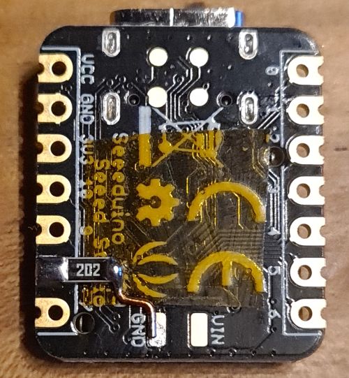

# JetiMiniVario

## What it is
JetiMiniVario is a variometer and altimeter.
Optionally, a Ublox GNSS module (M8 or M10) can be connected.

JetiMiniVario was developed to detect smallest air movements with a DLG.

Communication with the GNSS (GPS) device is done using the UBX protocol over UART.
If the device is set to 9600 baud before (factory setting) the necessary
configuration is done automatically. The NavPvt data set with 10Hz refresh rate
is used. The serial interface works with 19200 baud.

Communication with the RC-receiver (Jeti EX Bus) is done with a low level 
configured UART Peripheral at 125000 Baud. It works half duplex on a single pin.
The DMA is used in order to achieve a proper timing without collisions.

Communication with the sensor boards is done over I2C at 500kHz. 

JetiMiniVario is built from the following components:

 * A MCU board Seeed Studio XIAO (SAMD21G18)

 * One or two GY-63 boards with the MS5611 Barometric Pressure Sensor

 * A GNSS device with a module from Ublox. (i.e. Beitian BN-XXX BE-XXX) 

JetiMiniVario is optimized for very short response times
with low noise. Due to a free RC channel the filtering can be
adjusted continuously and thus the variometer can be be calmed down.
A gas-tight volume is provided between the sensor boards.
By encapsulating the sensor PCBs with thin epoxy plates and attaching
a tube connection one sensor can be connected to a TEK probe. 

A voltage divider 1:10 (recommended 2k and 18k each 0.1%) can be connected
to PIN_A9. The 3.3V are used as reference so a voltage up to 33V can be
applied. Accuracy is 1/100 V if calibrated, see below. 

## Mechanical design

First set the alternative address on one of the Sensors:  
  

Make both PCBs gasproof by using some epoxy:  
  

Connect the Sensor PCBs as shown:  
  

A connection to the mainboard is prepared with enameled copper wire:  
  

The wires are then connected as shown:  
  

  

External connections are as shown here:  
  

Ready to use product:  
  

## Electrical limits

JetiMiniVario can be powered by the RC receiver.
The voltage should not not exceed 6V. The voltage regulator
on the XIAO has 7V as absolut maximum rating. 4 cells of NiMh
are probably ok.

## Software

### Libraries

The software uses two libraries:
* Arduino-MS5611-Interrupt
* JetiExBus

To load the two libs at the same time you can use this command line:

git clone --recursive https://github.com/nichtgedacht/JetiMiniVario.git 
 
### IDE 
 
The repository here is to be used directly as a PlatformIO project.
It is as simple as:

* Install VSCode

* In VSCode install the PlatformIO extension. (Search by typing Plat...)

* Within PlatformIO open the directory of the repository as a project.
 
Because the Arduino Framework is used, the code can also be compiled in the Arduino IDE. 
For this, the extension for the SeedStudio XIAO must be installed first.
Then main.cpp must be renamed to JetiMiniVario.ino.
The correct board can then be selected in the board selection.

### Upload

Until the GNSS module was connected, the software was developed with a BlackMagicProbe
which also used the serial interface at A6 A7. 
The upload was done via the debug interface. In the current configuration
the upload is done via the USB-C connector.
It is of course still possible to work with the BlackMagicProbe if the
debug Serial.print goes through the USB-C connector. See "platformio.ini".
 
 
You can upload also one of the UF2 files:
* Short the reset contacts 2 times within 1/2 second.
* The yellow LED will slowly dim blink.
* The device will then register as mass storage
* Copy the UF2 file there

### Configuration

There are only these defines at the beginning of config.h:
* //#define DEBUG // debug prints or not

* #define DUAL // using one or two barometric pressure sensors  
    If dual pressure sensors are used one is for the variometer and the other becomes  
    altitude.

* #define GPS  // using the GNSS Modul or not
 
These defines depends on the assembled hardware. Please comment out what is not used
 
 

All other configuration can be done with a Command-Line-Interface:  

The following items can be configured with the CLI

* The RC-channel used for live adjusting the filters. 

* The RC-channel used to reset altitude and GNSS home position 
  The transition of channel value for reset must go from higher to lower 
  and difference must be greater than 300 (e.g. from 2000 to 1000 ). 
  Use the Servo Monitor 

* Priority of a sensor  

* Enable/disable a sensor  

* Calibrate the voltage sensor (ADC)  

For calibrating the voltage sensor:
* Disable calibration
* Apply a voltage arround 3V
* Read the measured voltage
* Change the values for applied and measured voltages
* Do the same for a voltage arround 30V
* Enable calibration
* Write changes

As terminal emulation Putty can be used. The default settings of Putty are ok.  
Just select the serial interface connected to the device. Choose at least 60x33.
Putty is available for Linux, and Windows.
